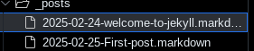
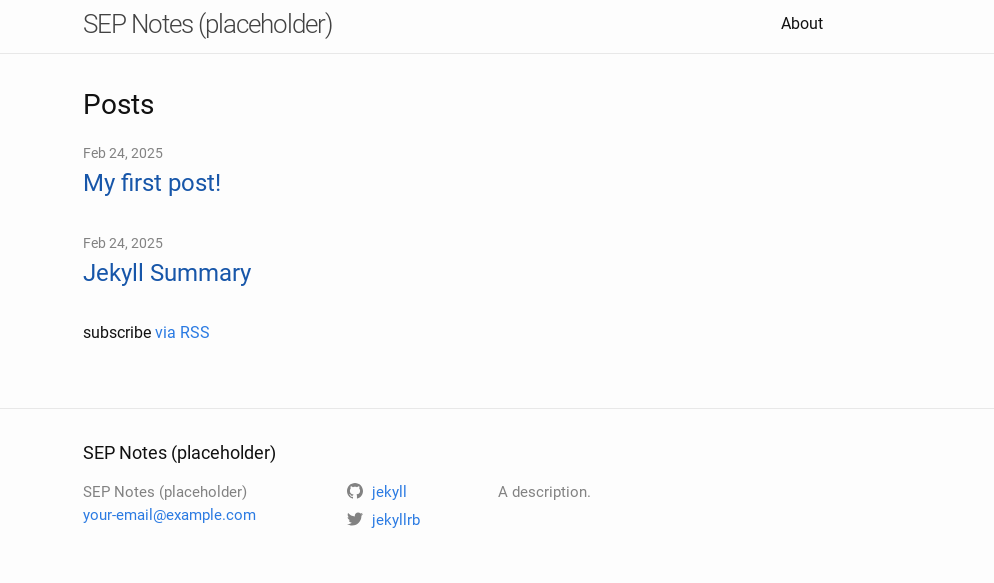

# Entry 4
##### 2/25/25

### Freedom Project Tool
The tool that I decided to _learn_ about was **Jekyll**. This is a tool that _automatically_ converts **markdown** into **HTML**.
#### How I started to get some sort of understanding of it:
According to what I understood about Jekyll when I read through [this tutorial](https://kinsta.com/blog/jekyll-static-site/), you can _clone_ **templates** found in [github](https://github.com/) into your **IDE**. These are called "themes".
In order to find out _basic information_ on how to use this tool, I went directly to [their main site](https://jekyllrb.com/docs/usage/), and **read** through the list of commands. From this, I realized that the **most important**
commands in Jekyll were `jekyll new PATH` and `jekyll s`.
* `jekyll new PATH`
  * This creates a new directory with all the **default files needed to use Jekyll.**
  * `PATH` is the _name._
* `jekyll s`
  * Basically `http-server` but for Jekyll.
#### How I tinkered with Jekyll:
When I first started tinkering with Jekyll, I had already used  `jekyll s` and got a `_site` folder. However, at the time I didn't realize that everything in this folder **wouldn't save**, so I tried to change the default title and description. The result was that everything I _reloaded the preview_, nothing changed. I had to search it up online when I found [this question posted on a site](https://stackoverflow.com/questions/45090500/jekyll-assets-get-deleted). This was when I realized that **everything** in `_site` would be **deleted** when the page is _refreshed_ and _nothing saves_ in it. In order for the title and description to _save_, I had to edit in `_config.yml`.   
For example, in `_site`, when I tried to change from this:
```html
 <h2 class="footer-heading"> Your awesome title</h2>
<li class="p-name"> Your awesome title</li><li><a class="u-email" href="mailto:your-email@example.com">your-email@example.com</a></li></ul>
<p>
Write an awesome description for your new site here. You caan edit this line in _config.yml. It will appear in your document head meta (for Google search results) and in your feed.xml site description.
</p>
```
to this:
```html
 <h2 class="footer-heading"> SEP Notes (placeholder)</h2>
<li class="p-name"> SEP Notes (placeholder) </li><li><a class="u-email" href="mailto:your-email@example.com">your-email@example.com</a></li></ul>
<p> A description.
</p>
```
it ended up being **deleted** when the page was refreshed.
##### Next, I tried to make a post.  
In order to make my first post, I followed this **format**: 
`year-month-day-title.markdown`  
  * Year is **4** digits.
  * Month has to have **2** digits.
  * Day has to have **2** digits.
  * Title can be **anything**.
    
  
This was the result of everything I changed:  

### Skills


[Previous](entry03.md) | [Next](entry05.md)  
[Home](../README.md)
