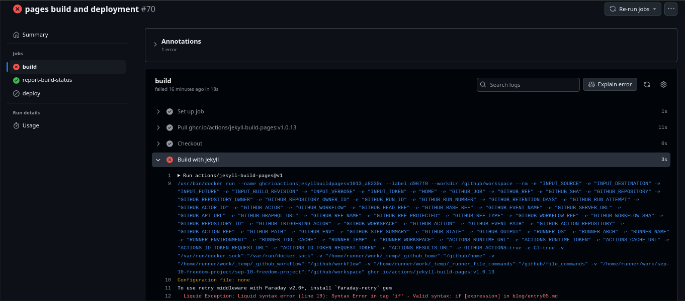

# Entry 5
##### 4/1/25

### Jekyll Part 2  
After learning about the basics of Jekyll, I learned more advanced things such as `liquid` and `font-matter-defaults`.
### What I've learned:  
* ``
  * **Makes** a variable and set its value to "variable-name".
* `| filler`
  * Goes right before `%}` and **changes** the _string_.
    * Strings are basically, _what the user sees_ when they load the website.
* `{{ variable }}`
  * A piece of liquid code that shows the **value of a variable** as a string.
* ``
  * If the **statement is true**, run:
   * Ends with ``.
* ``
  * If the **value of this variable** contains this **text**, run:
* ``
  * Allows a _second condition to be true_ **when the first is false** to make a **different** string.
* ``
  * Opposite of `if`.
* ``
  * `For loop`, allows the code to run **multiple** times.
``` yaml
defaults:
  -
    scope:
      path: "" # an empty string here means all files in the project
    values:
      type: "posts"
      layout: "post"
      author: "William"
```
> Sets the _layout_ to be "post" on **all** _posts_ (In `_posts`) and the author variable to be "William".
* ``
  * Jekyll's own code for **syntax highlighting** and showing code on a website.
* `gem "github-pages", "~> 232", group: :jekyll_plugins`
  * Also add a `#` in front of `gem "jekyll", "~> 4.3.4"`.
   * Jekyll has a different way of using `github pages`; you must change the gem to `github-pages`.
``` yaml
---
title:  "Jekyll Summary"
date:   2025-02-24 14:09:28 -0500
categories: jekyll-update
permalink: /welcome-to-jekyll/
layout: post.html
---
```
* **Font matter** for a page.
  * Allows you to change the **settings** for a page, also allows for the creation of _variables_.
* `_includes`
  * A special directory that allows you to "include" pieces of code in your text.
 * ``
   * Places the text in `bootstrap-head-required.html` in the area where it's placed.
* Changing `Gemfile.lock`.
  * Delete `Gemfile.lock` and do `bundle install` to get an updated version.
* `href="{{ site.baseurl }}"`
  * Required to use this syntax for links to use `github pages`.
### How I learned:
When learning more about Jekyll **beyond** the basics, I mainly learned about `liquid` code from [this website](https://shopify.github.io/liquid/basics/introduction/). However, I also learned about _Jekyll's own `liquid` tags_ from [the official Jekyll site](https://jekyllrb.com/).  
Afterwards, I mainly used [this site](https://talk.jekyllrb.com/) whenever I encountered an error.  

Here's how it went:  
I first started off by going to [a site that teaches the basics of liquid](https://shopify.github.io/liquid/basics/introduction/) and going through the proper formatting with how to make and use variables.  

For example:  
``` liquid

{{ a_variable }}
```
> * Short summary of the basics of `liquid`:
>   * Whenever you want to use any **logic** `tags` or _**assign**ing a value to a variable_, you **must** have a **single curly bracket** followed by a **%** **opening** the `tag` and **closing** it.
>     * Users are **unable** to see ``tags``; they occur in the **backend** of a website.
>   * When using `objects`, you use **double curly brackets** **opening** the `object` and **closing** it.
>     * Users **can** see `objects`; they **appear in** the website.

After I learned about the basic _formatting_ of liquid code, I tried to make my own.  
Here's what I made:  
``` liquid

<strong> This page's title contains "Jekyll" </strong>

This page does not contain "Jekyll"



{{ var_2 }}




{{ categories }} Extra Text

<h2> Does not contain "Testing" </h2>


```
Here's another:  
``` liquid


{{ page.author }}, a student from HSTAT.

{{ author2 }}




Hello, my name is {{ author2 }} My hobbies are {{ hobbies }}

{{ introduction }}
```
### Skills
Two skills that I've developed since the previous entry are **logical reasoning** and **attention to detail**.  
#### Logical Reasoning
Since I'm learning about using `liquid` tags, naturally, I would come into contact with logic tags such as `if` `else` statements. In order to use these statements efficiently, I had to think logically; if I add a certain category to `postA`, `postB` and `postC`, but don't add it to `postD`, and I wanted to add a string at the top of `postA`, `postB` and `postC`, I would do:  
``` liquid

a string

```
However, if I wanted to add a string to only `postD`, I would do:  
``` liquid

a string

```
#### Attention to Detail
When using `liquid`, a single error in _adhering to syntax rules_ could lead to your website just **not loading properly**; one error and `github-pages` just can't deploy at all.  
For example, if I had `{% if page.title contains "a word }` and do `git add .`, `git commit -m "message"`, and `git push`, when I try to setup `github-pages`, it would fail to deploy the website. I would have to fix all the errors in the syntax, in this case being the **missing** _"_ and _%_:  
``  
If I make multiple errors in syntax rules, it could **waste a lot of time** due to having to wait for [github](https://github.com/) to `build` and `deploy` every time.  
In fact, when I go to the `Actions` page in [github](https://github.com/) on this repository, **I get an error due to the incorrect syntax in this entry**. (Strings not being defined, syntax error with the missing `"` and `%`, etc.)  



[Previous](entry04.md) | [Next](entry06.md)

[Home](../README.md)


