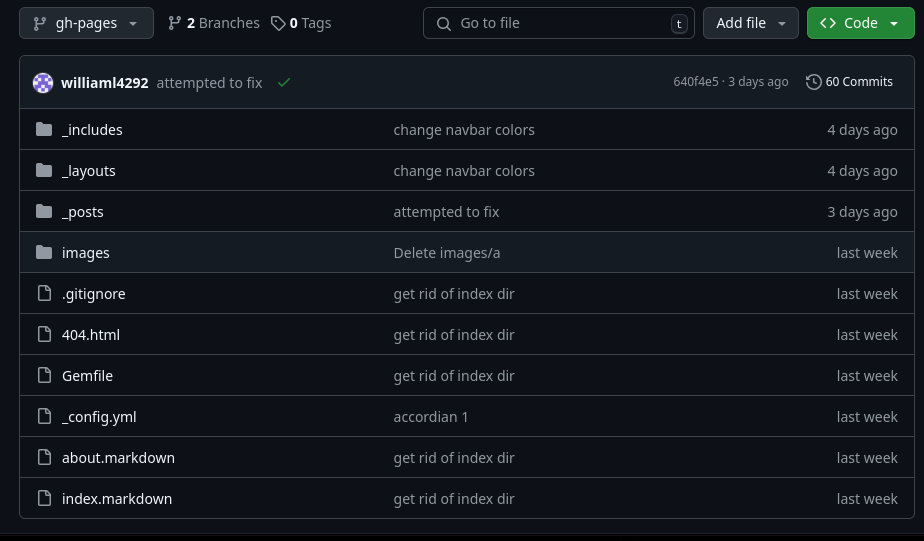
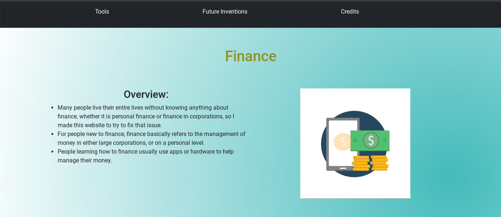

# Entry 6
##### 5/5/25

### Freedom Project: Minimal Viable Project (MVP)
Before we even started to make our **MVP**, we made a bunch of [wireframes](https://wireframe.cc/) for _both mobile and desktop devices_.  
After we finished making them and got a _perfect_ score, we would then go on to making a [plan](https://github.com/williaml4292/sep-10-freedom-project/blob/main/prep/plan.md).  
Afterwards, we would enable **Github Pages**.  
Finally, we would start to add our content to the website and applying CSS.  
However, as I was using [Jekyll](https://jekyllrb.com/), I had some issues with something I never tried before: using Jekyll in a subdirectory.  
I tried to use the normal way shown in [this site](https://docs.github.com/en/pages/setting-up-a-github-pages-site-with-jekyll/creating-a-github-pages-site-with-jekyll), but **it didn't work**, so I **made another branch** instead.  
I ended up having to make a **gh-pages** branch in order for me to use Jekyll.  
This was made by using these commands:  
```bash
git checkout --orphan gh-pages
git rm -rf .
jekyll new index
cd index
mv (all-files) ..
cd ..
rm -rf index
git add .
git commit -m "new jekyll site"
git push -u origin gh-pages
```
The _first two commands_ **make the branch, gh-pages, and deletes all folders and files in the branch**, while the _last command_ **pushes everything and sets the push destination to gh-pages**. The other commands are for **making the jekyll site**, however I had to **move** _all the files out of the index folder_ in order for **gh-pages** to work properly.  
What it looks like:  
  
After setting up **gh-pages**, I added the _content_ and the _colors_, including a **animated** `linear-gradient` that I found out could be made using **radical** linear-gradients.  
What my index looks like:  
  
#### Other challenges when making my MVP:
Other than setting up **gh-pages** being a problem, I also had problems figuring out how to make a **animated** `linear-gradient`.  
This is the case because when you use animation, you are _**unable** to add_ linear-gradients to the `@keyframes`.  
However, I managed to figure it out after coming across [this post](https://stackoverflow.com/questions/56409340/keyframes-gradient-background-is-not-animated).  
#### Some takeaways:
* When trying to figure out a problem that you can't solve, just **search** it up on _google_ and find a post where **others have already asked the same question**.  
* When setting up **gh-pages**, even if you do `git rm -rf .`and delete everything, as long as you are **pushing to `gh-pages`**, you won't affect anything on the `main branch`.  
### Engineering Design Process (EDP)
I am currently at **stage 6** of the EDP, which is _testing and evaluating the prototype_ that I've created. I've already finished the **MVP**, but I still wasn't given any feedback on my website as of the time of writing this. My **next step** after I get enough feedback would be to **perfect** my website using all the feedback given.
### Skills
Two skills that I've developed since the previous entry are **debugging** and **time management**.
#### Debugging
When working on my _Freedom Project_ and adding accordions to my files, I kept having to _copy and paste_ sections of the accordion, which caused me frequently _mess up my_ `divs` whenever I had to **add a line of code between them**, such as a `img` or a `h2`.  
This is a significant issue because whenever my `divs` were messed up, my **color scheme was ruined** due to elements suddenly appearing **outside** of the `background-color` when they're not supposed to.  
Sometimes, my content ended up looking werid whenever I _previewed_ it.  
For example, if my `divs` were wrong, whenever I used the **bootstrap grid system**, my `columns` would sometimes be **outside** of the `row` and the grid would simply not work. This would make a ton of extra **white space**, which didn't look good.  
In order to debug this, I pulled [the bootstrap docs](https://getbootstrap.com/docs/5.3/components/accordion/) back up and looked at all the `divs` that the accordions used.  
Afterwards, I _experimented_ with the placement of the `divs` in my code until the **alignment started working** again.
#### Time Management
Since we had a very **limited** time for making the **MVP**, I had to decide on the tasks that were more **important** for me to do.  
Should I **make a completely new navbar** and _customize it from scratch_ to fit the theme of my website?  
Or should I use a **basic** `navbar`?  
Or should I use a `navbar` that I previously made in another repository?  
I chose to _copy and paste_ the `navbar` that I had from a separate repository that I used to **test** _bootstrap components and Jekyll_.  
Afterwards, I **deleted** the `background-color` that the `navbar` had, _changed the color of the text to white_, and _changed the_ **margins** _and the_ **links**.  
After that, _I focused completely_ on **adding all my content** to the website.  
I ended up after around **3 days of worktime left**, without counting the weekend, which let me _spend the remainder of the time on `media queries`_ to add better **responsiveness** to the website.  


[Previous](entry05.md) | [Next](entry07.md)

[Home](../README.md)
